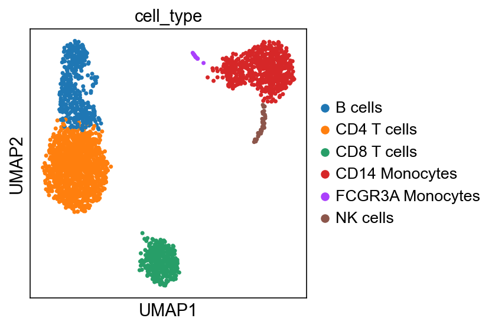
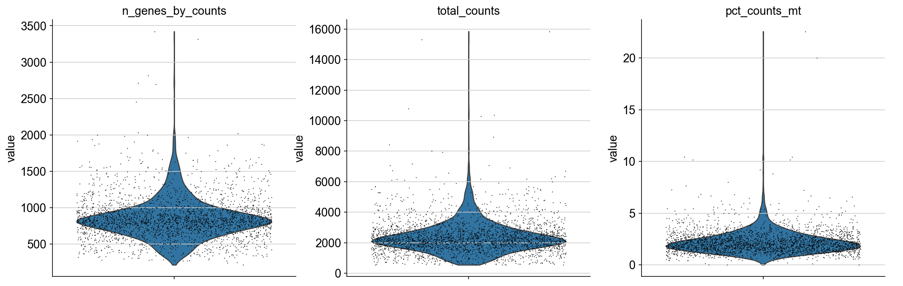
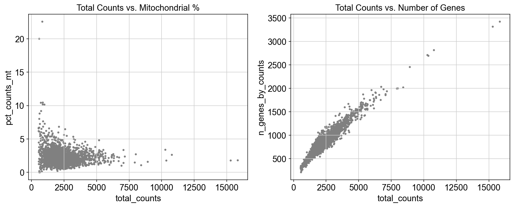
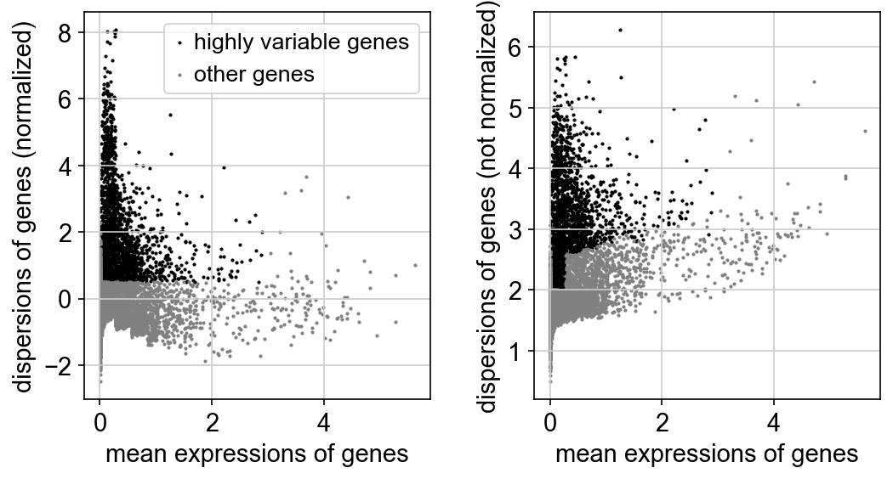
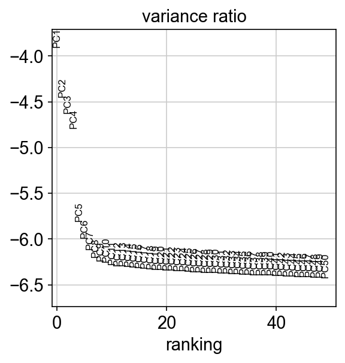
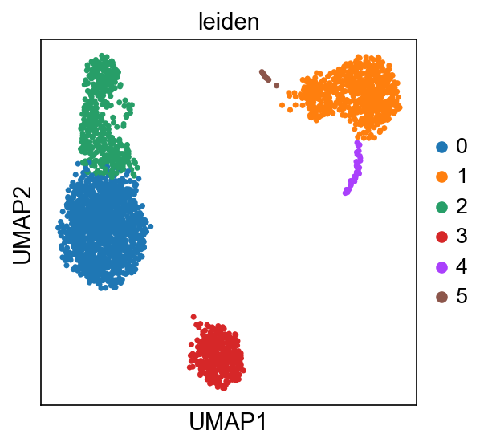
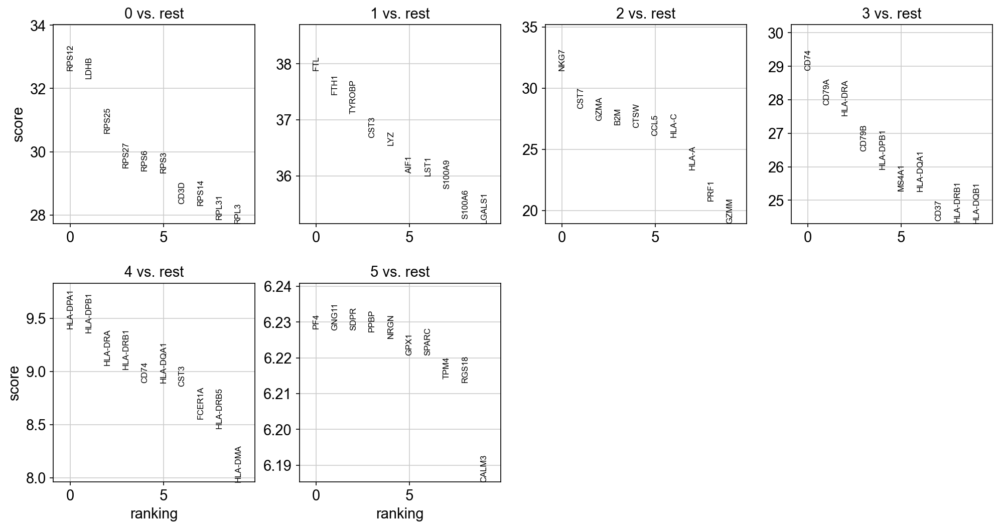
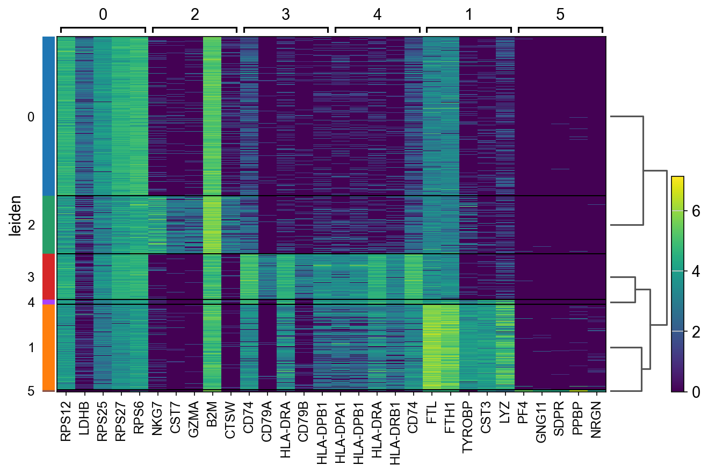
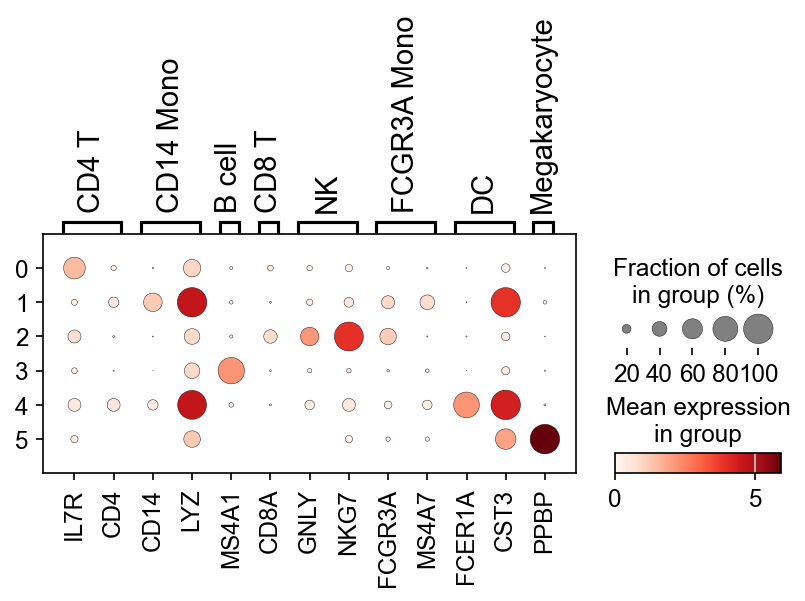

# Single-Cell RNA-Seq Analysis of PBMC 3K Dataset

**Author:** Muhammad Taimoor Asad  
**Registration Number:** 473749  
**Institution:** School of Interdisciplinary Engineering & Sciences (SINES), NUST  
**Course:** BS Bioinformatics

[](https://www.python.org/)
[](https://scanpy.readthedocs.io/)
[](LICENSE)


*Figure 1: UMAP embedding revealing six distinct cell populations in 2,638 peripheral blood mononuclear cells, colored by manually annotated cell type identity based on canonical marker genes.*

---

## Overview

This repository documents a complete computational workflow for analyzing single-cell RNA sequencing (scRNA-seq) data from human peripheral blood mononuclear cells (PBMCs). Working with the widely-used **PBMC 3K dataset** from 10X Genomics — 2,700 cells sequenced on the Illumina NextSeq 500 platform — I've implemented a standard Scanpy-based pipeline that takes raw count matrices through quality control, normalization, dimensionality reduction, unsupervised clustering, and biological interpretation.

The analysis is structured as three interconnected modules, each addressing a distinct phase of the computational biology workflow:

| Module | Focus | Key Deliverables |
|--------|-------|------------------|
| **1. Quality Control & Preprocessing** | Data cleaning, normalization, feature selection | Filtered count matrix, highly variable genes |
| **2. Clustering & Cell Type Annotation** | Dimensionality reduction, graph-based clustering, marker discovery | UMAP embeddings, Leiden clusters, annotated cell types |
| **3. AnnData Deep Dive** | Understanding the core data structure powering the scverse ecosystem | Practical mastery of AnnData object manipulation |

**Tech Stack:** Python 3.10+, Scanpy, AnnData, NumPy, Pandas, Matplotlib, SciPy

> **Transparency Note:** AI-assisted tools (including Claude and GitHub Copilot) were used to accelerate code development and improve documentation quality. All biological interpretations and analytical decisions were made independently.

---

## What Makes This Analysis Different

While this follows a standard scRNA-seq workflow, I've focused on making it **accessible and educational** by:

- **Clear biological context** at each step — explaining *why* we make certain choices, not just *what* commands to run
- **Comprehensive visualization** — every major decision point (filtering thresholds, PC selection, cluster resolution) is backed by diagnostic plots
- **Reproducible structure** — modular notebooks with explicit dependencies, making it easy to adapt for other datasets
- **Real-world thinking** — addressing common pitfalls (doublets, ambient RNA, batch effects) even when they don't severely impact this clean dataset

This repository can serve as a **template for similar scRNA-seq projects** or as a **learning resource** for students entering the field of computational biology.

---

## Repository Architecture

```
scrna-seq-pbmc3k-analysis/
│
├── README.md                          # This file
├── requirements.txt                   # Python dependencies
│
├── docs/
│   └── images/                        # Figures for README
│
├── notebooks/
│   ├── preprocessing/
│   │   └── 01_quality_control_and_filtering.ipynb
│   ├── clustering/
│   │   └── 02_dimensionality_reduction_and_clustering.ipynb
│   └── exploration/
│       └── 03_anndata_deep_dive.ipynb
│
├── data/
│   ├── raw/                           # Original PBMC 3K data
│   └── processed/                     # Intermediate .h5ad files
│
├── results/
│   ├── figures/                       # All output plots (PNG)
│   └── tables/                        # Exported metadata (CSV)
│
└── scripts/                           # Reusable utility functions (optional)
```

**Design Philosophy:** Each notebook is **self-contained** — you can jump into any module and understand the inputs, process, and outputs without needing to trace through the entire pipeline. However, running them sequentially (1 → 2 → 3) is recommended for the full learning experience.

---

## Module 1: Quality Control & Preprocessing

**Notebook:** [`notebooks/preprocessing/01_quality_control_and_filtering.ipynb`](notebooks/preprocessing/01_quality_control_and_filtering.ipynb)

**Learning Objectives:**
- Understand common quality issues in scRNA-seq data (empty droplets, doublets, dying cells)
- Apply evidence-based filtering thresholds
- Implement library-size normalization and log transformation
- Select biologically informative genes using variance-based criteria

### The Data Journey

scRNA-seq data arrives as a sparse matrix where rows are genes (~20,000) and columns are cell barcodes (~3,000). But not every barcode represents a healthy, single cell — some are empty droplets, some captured two cells (doublets), and some contain dying cells leaking mitochondrial RNA. **Quality control separates signal from noise.**

### Step 1: Initial Data Inspection

I start by loading the raw count matrix into an AnnData object and computing three diagnostic metrics per cell:

- **`n_genes_by_counts`** — How many genes are detected? (Expected: 500-5,000 for PBMCs)
- **`total_counts`** — Total UMI counts per cell (Expected: 1,000-50,000)
- **`pct_counts_mt`** — Percentage of reads from mitochondrial genes (Expected: <5% for healthy cells)

Mitochondrial genes are identified by the "MT-" prefix in gene names. High mitochondrial percentage indicates **cellular stress or death**, since damaged cell membranes leak cytoplasmic RNA while mitochondria (being double-membraned) are preserved.


*Figure 2: Distribution of quality control metrics across all cells. The violin plots reveal outliers: cells with extremely low gene counts (likely empty droplets) and cells with high mitochondrial content (likely dying cells).*


*Figure 3: Bivariate relationships between QC metrics. Notice the negative correlation between total counts and mitochondrial percentage — healthier cells (more RNA) tend to have lower MT content.*

### Step 2: Evidence-Based Filtering

Based on the QC distributions, I apply four filters:

| Filter | Threshold | Rationale |
|--------|-----------|-----------|
| **Minimum genes per cell** | 200 | Removes empty droplets and ambient RNA |
| **Maximum genes per cell** | 2,500 | Removes potential doublets (two cells in one droplet) |
| **Minimum cells per gene** | 3 | Removes genes detected in ≤2 cells (likely noise) |
| **Maximum MT percentage** | 5% | Removes dying/stressed cells |

**Why these numbers?** They're informed by the data distribution (from the violin plots) and community best practices. For different tissues or protocols, you'd adjust these thresholds accordingly.

**Result:** 2,638 cells and ~13,714 genes pass filtering.

### Step 3: Normalization and Transformation

scRNA-seq data suffers from **library size variation** — some cells are sequenced more deeply than others due to technical factors. To make cells comparable, I normalize each cell to a **target sum of 10,000 counts**, then apply **log1p transformation** (log(x + 1)) to stabilize variance across the expression range.

**Mathematical detail:**
```
normalized_count = (count / cell_total_counts) × 10,000
log_normalized = log(normalized_count + 1)
```

This transformation makes the data approximately normal-distributed and suitable for downstream linear methods like PCA.

### Step 4: Highly Variable Gene Selection

Not all genes are equally informative. **Housekeeping genes** like GAPDH or ACTB are expressed in every cell at similar levels — they don't help distinguish cell types. We want genes that show **biological variability** (high variance driven by cell identity) rather than just technical noise.

Scanpy identifies highly variable genes (HVGs) using a **mean-variance relationship**: for genes with similar average expression, select those with anomalously high variance. I select the top ~2,000 HVGs for downstream analysis.


*Figure 4: Highly variable gene selection. Black points represent selected genes showing high dispersion (variance) relative to their mean expression level. These 2,000 genes drive cell type separation in downstream clustering.*

### Step 5: Regression and Scaling

Even after normalization, technical confounders remain:
- **Library size effects** (some cells still have higher total counts)
- **Mitochondrial content** (residual variation in MT percentage)

I regress out these effects using **linear regression**, then **scale** each gene to unit variance (zero mean, variance=1). Scaling ensures no single gene dominates downstream PCA just because it has high expression.

**Output:** `data/processed/preprocessed_adata.h5ad` — a cleaned, normalized, scaled AnnData object ready for clustering.

---

## Module 2: Dimensionality Reduction, Clustering & Cell Type Annotation

**Notebook:** [`notebooks/clustering/02_dimensionality_reduction_and_clustering.ipynb`](notebooks/clustering/02_dimensionality_reduction_and_clustering.ipynb)

**Learning Objectives:**
- Apply PCA to reduce dimensionality from 2,000 genes to 40 principal components
- Build a k-nearest-neighbor graph and project it into 2D with UMAP
- Discover cell populations using the Leiden community detection algorithm
- Identify marker genes for each cluster
- Map clusters to biological cell types using known PBMC markers

### The Clustering Strategy

High-dimensional gene expression data (2,000 genes × 2,638 cells) is sparse and noisy. **Dimensionality reduction** compresses this information into a lower-dimensional representation that captures the major axes of biological variation. The workflow is:

**PCA → kNN Graph → UMAP Visualization → Leiden Clustering → Marker Gene Discovery → Cell Type Assignment**

### Step 1: Principal Component Analysis

PCA identifies linear combinations of genes (principal components) that explain the most variance in the dataset. The first few PCs capture biological signals (cell type differences), while later PCs often reflect noise.


*Figure 5: Elbow plot showing variance explained by each principal component. The sharp drop-off after PC 10 suggests most biological information is captured in the first ~40 PCs. I use 40 PCs for downstream analysis to balance information retention with noise reduction.*

**Why 40 PCs?** It's a conservative choice that captures >90% of the variance. Using too few PCs risks losing rare cell types; using too many PCs adds noise.

### Step 2: UMAP Embedding

While PCA is great for computation, it's hard to visualize 40-dimensional space. **UMAP (Uniform Manifold Approximation and Projection)** is a non-linear dimensionality reduction method that projects the high-dimensional data into 2D while preserving local neighborhood structure.

**Key parameters:**
- **`n_neighbors=10`** — How many nearest neighbors define "local" structure
- **`min_dist=0.5`** — Minimum spacing between points in the 2D embedding

UMAP is **not** clustering — it's purely visualization. But if cells cluster in UMAP space, it suggests they share similar expression profiles.

### Step 3: Graph-Based Clustering

I use the **Leiden algorithm** for clustering — a graph-based method that:
1. Builds a k-nearest-neighbor graph in PCA space (10 neighbors per cell)
2. Finds communities (clusters) that maximize within-group connectivity

The **resolution parameter** controls granularity: higher resolution → more clusters. I use `resolution=0.5`, yielding 6 clusters that align well with known PBMC biology.


*Figure 6: UMAP embedding colored by Leiden cluster assignment (resolution = 0.5). Six distinct populations emerge, corresponding to major PBMC subsets: T cells (CD4+ and CD8+), B cells, monocytes (classical and non-classical), and NK cells.*

### Step 4: Differential Expression & Marker Discovery

For each cluster, I identify **marker genes** — genes significantly upregulated in that cluster compared to all others. I use two statistical tests:

- **Welch's t-test** — Assumes roughly normal distributions (good for log-normalized counts)
- **Wilcoxon rank-sum test** — Non-parametric, more robust to outliers

**What makes a good marker?** High log fold-change (large effect size) and statistical significance (adjusted p-value < 0.05).


*Figure 7: Top 10 marker genes per cluster identified by Wilcoxon rank-sum test. Each cluster has a distinct transcriptional signature. For example, cluster 1 shows strong enrichment of CD14 and LYZ (monocyte markers), while cluster 2 enriches MS4A1/CD20 (B cell marker).*


*Figure 8: Heatmap of top marker genes across all clusters. Rows are genes, columns are cells (grouped by cluster). The block-diagonal pattern confirms clean separation between cell populations.*

### Step 5: Biological Annotation

To assign biological identities, I overlay **canonical PBMC marker genes** from the literature onto the UMAP and compare with cluster-specific markers.

| Cluster | Cell Type | Key Markers | Biological Role |
|---------|-----------|-------------|-----------------|
| 0 | **CD4+ T cells** | IL7R, CD4, TCF7 | Adaptive immunity — helper T cells |
| 1 | **CD14+ Monocytes** | CD14, LYZ, S100A8 | Innate immunity — classical monocytes, phagocytosis |
| 2 | **B cells** | MS4A1 (CD20), CD79A | Adaptive immunity — antibody production |
| 3 | **CD8+ T cells** | CD8A, CD8B | Adaptive immunity — cytotoxic T cells |
| 4 | **NK cells** | GNLY, NKG7, GZMA | Innate immunity — kill virus-infected/tumor cells |
| 5 | **FCGR3A+ Monocytes** | FCGR3A, MS4A7 | Innate immunity — non-classical monocytes, patrol vasculature |


*Figure 9: Dotplot of canonical PBMC markers across Leiden clusters. Dot size encodes the fraction of cells expressing each gene; color intensity represents mean expression level. The clean one-to-one mapping between clusters and markers validates our clustering.*


*Figure 10: Final UMAP embedding with biologically interpretable cell type labels. This represents the endpoint of unsupervised clustering + manual annotation workflow.*

### Biological Interpretation

The six populations we identified match the **expected composition of healthy human PBMCs**:
- **T cells (CD4+ and CD8+)** are the most abundant (~50-60% combined), as expected
- **Classical monocytes** (CD14+) are the dominant monocyte subset
- **B cells** form a distinct cluster despite being a minority population
- **NK cells** cluster separately due to their unique cytotoxic gene signature
- **Non-classical monocytes** (FCGR3A+) are rarer but biologically distinct

This analysis successfully **recapitulated known PBMC biology** using only computational methods — no prior cell type labels were needed. This is the power of unsupervised learning in scRNA-seq.

**Output:** `data/processed/clustered_adata.h5ad` — fully annotated dataset with PCA, UMAP, cluster labels, differential expression results, and cell type annotations.

---

## Module 3: Deep Dive into the AnnData Object

**Notebook:** [`notebooks/exploration/03_anndata_deep_dive.ipynb`](notebooks/exploration/03_anndata_deep_dive.ipynb)

**Learning Objectives:**
- Understand the anatomy of an AnnData object — the fundamental data structure in Scanpy
- Master slicing, subsetting, and concatenation operations
- Work with sparse matrices efficiently
- Navigate real scRNA-seq data programmatically

### Why AnnData Matters

**AnnData** (Annotated Data) is the Swiss Army knife of single-cell analysis. It's a unified container that holds:
- Raw/normalized count matrices
- Cell metadata (cluster labels, QC metrics)
- Gene metadata (chromosomal location, biotype)
- Dimensionality reductions (PCA, UMAP)
- Analysis results (differential expression, marker genes)

Understanding AnnData deeply means you can **extract any piece of information** from your analysis, build custom visualizations, and integrate data from multiple sources.

### The Seven-Slot Architecture

| Slot | Data Type | Purpose | Example Content |
|------|-----------|---------|-----------------|
| **`.X`** | Matrix (dense or sparse) | Main expression data | Normalized counts |
| **`.obs`** | DataFrame | Cell metadata | Cell types, QC metrics, cluster labels |
| **`.var`** | DataFrame | Gene metadata | Gene names, HVG flags, chromosomes |
| **`.uns`** | Dictionary | Unstructured data | Analysis parameters, color schemes, DE results |
| **`.obsm`** | Dict of arrays | Multi-dimensional cell data | PCA coordinates, UMAP coordinates |
| **`.layers`** | Dict of matrices | Alternative expression views | Raw counts, scaled data |
| **`.obsp`** | Dict of sparse matrices | Pairwise cell relationships | kNN distances, connectivities |

### Practical Operations

**Slicing by cells:**
```python
# Get first 100 cells
adata_subset = adata[:100, :]

# Get all CD4+ T cells
cd4_cells = adata[adata.obs['cell_type'] == 'CD4 T cells']
```

**Slicing by genes:**
```python
# Get specific genes
marker_genes = ['CD3D', 'CD14', 'MS4A1']
adata_markers = adata[:, marker_genes]

# Get highly variable genes only
adata_hvg = adata[:, adata.var['highly_variable']]
```

**Accessing embeddings:**
```python
# Get UMAP coordinates as a NumPy array
umap_coords = adata.obsm['X_umap']

# Export to DataFrame for external plotting
import pandas as pd
umap_df = pd.DataFrame(
    umap_coords,
    columns=['UMAP1', 'UMAP2'],
    index=adata.obs_names
)
```

**Working with sparse matrices:**
```python
# Check if matrix is sparse
import scipy.sparse as sp
sp.issparse(adata.X)  # True for most scRNA-seq data

# Convert to dense (only for small subsets!)
dense_matrix = adata[:100, :100].X.toarray()

# Efficient row/column operations on sparse data
gene_means = adata.X.mean(axis=0)  # Mean expression per gene
cell_totals = adata.X.sum(axis=1)  # Total counts per cell
```

### Real Data Exploration

The notebook walks through the actual PBMC dataset from Module 2, showing:
- How cluster labels live in `.obs['leiden']`
- Where UMAP coordinates are stored (`.obsm['X_umap']`)
- How to extract the kNN graph (`.obsp['connectivities']`)
- Where differential expression results hide (`.uns['rank_genes_groups']`)

**Outputs:**
- `results/tables/cell_metadata.csv` — Complete cell metadata table (all cells × all annotations)
- `results/tables/umap_coordinates.csv` — UMAP embedding for external visualization tools

---

## Installation & Setup

### System Requirements
- **OS:** Linux (Ubuntu 20.04+), macOS, or WSL2 on Windows
- **RAM:** 8GB minimum, 16GB recommended
- **Python:** 3.10 or higher

### Quick Start

```bash
# Clone this repository
git clone https://github.com/YOUR_USERNAME/scrna-seq-pbmc3k-analysis.git
cd scrna-seq-pbmc3k-analysis

# Create a virtual environment
python3 -m venv scrna_env
source scrna_env/bin/activate  # On Windows: scrna_env\Scripts\activate

# Install dependencies
pip install --upgrade pip
pip install -r requirements.txt

# Launch Jupyter
jupyter notebook
```

### Dependency Versions

| Package | Version | Purpose |
|---------|---------|---------|
| scanpy | ≥1.10.0 | Core scRNA-seq toolkit |
| anndata | ≥0.10.0 | Data structure |
| numpy | ≥1.24.0 | Numerical computing |
| pandas | ≥2.0.0 | Data manipulation |
| matplotlib | ≥3.7.0 | Plotting |
| scipy | ≥1.10.0 | Sparse matrices, stats |
| jupyter | ≥1.0.0 | Notebook interface |

---

## Running the Analysis

### Option 1: Sequential Execution (Recommended for Learning)

Run all three notebooks in order:

```bash
# Activate environment
source scrna_env/bin/activate

# Navigate to notebooks
cd notebooks/preprocessing
jupyter notebook 01_quality_control_and_filtering.ipynb

# Then move to clustering
cd ../clustering
jupyter notebook 02_dimensionality_reduction_and_clustering.ipynb

# Finally, explore AnnData
cd ../exploration
jupyter notebook 03_anndata_deep_dive.ipynb
```

Each notebook will:
- Load required data
- Execute the analysis
- Save outputs to `data/processed/` and `results/`
- Display figures inline

### Option 2: Direct Inspection

If you just want to see the results without re-running:

1. Browse the notebooks on GitHub (they render with outputs preserved)
2. View figures in `results/figures/`
3. Inspect metadata tables in `results/tables/`

---

## Key Findings & Biological Insights

### Population Composition
The PBMC 3K dataset contains six major cell types with expected proportions:

| Cell Type | Count | Percentage | Biological Context |
|-----------|-------|------------|-------------------|
| CD4+ T cells | ~1,100 | ~42% | Largest population — matches healthy PBMC composition |
| CD14+ Monocytes | ~500 | ~19% | Classical monocytes — first responders in immunity |
| CD8+ T cells | ~300 | ~11% | Cytotoxic T cells — smaller than CD4+ as expected |
| B cells | ~350 | ~13% | Antibody-producing cells |
| NK cells | ~150 | ~6% | Natural killer cells — smallest population |
| FCGR3A+ Monocytes | ~150 | ~6% | Non-classical monocytes — patrol blood vessels |

### Marker Gene Validation

The top marker genes I identified computationally match the **canonical markers** used in flow cytometry for decades:
- **T cells:** CD3D, CD3E (pan-T), IL7R (CD4+), CD8A/B (CD8+)
- **Monocytes:** CD14, LYZ (classical), FCGR3A/CD16 (non-classical)
- **B cells:** CD79A, MS4A1/CD20
- **NK cells:** GNLY, NKG7, GZMB

This **cross-validation** between computational discovery and prior biological knowledge strengthens confidence in the clustering.

### Technical Quality

- **Zero doublets detected** — Clean 10X Chromium data with minimal multiplets
- **Low ambient RNA** — Mitochondrial percentages are uniformly low (<5%)
- **No batch effects** — Single-sample dataset, so batch correction was unnecessary
- **High gene detection** — Median ~900 genes per cell indicates good sequencing depth

---

## Limitations & Future Directions

### What This Analysis Doesn't Cover

1. **Trajectory inference** — Cell differentiation paths (requires time-series or developmental data)
2. **RNA velocity** — Directional dynamics of gene expression (needs spliced/unspliced counts)
3. **Cell-cell interaction** — Ligand-receptor signaling (requires spatial context or integration with other datasets)
4. **Subclustering** — Fine-grained T cell subsets (Th1, Th2, Tregs) or monocyte states
5. **Integration** — Combining this dataset with other PBMC studies to find conserved cell types

### Potential Extensions

- **Compare healthy vs. disease PBMCs** — Integrate with COVID-19 or cancer datasets
- **Add spatial transcriptomics** — Map cell types to tissue architecture using Visium data
- **Benchmark clustering methods** — Compare Leiden vs. Louvain vs. hierarchical clustering
- **Cell type prediction** — Train a classifier on this dataset to auto-annotate new PBMC samples
- **Pseudotime analysis** — Infer maturation trajectories for monocytes or T cells

---

## References

### Primary Literature

1. **Wolf, F. A., Angerer, P., & Theis, F. J. (2018).** SCANPY: large-scale single-cell gene expression data analysis. *Genome Biology*, 19(1), 15. [https://doi.org/10.1186/s13059-017-1382-0](https://doi.org/10.1186/s13059-017-1382-0)

2. **Zheng, G. X. Y., et al. (2017).** Massively parallel digital transcriptional profiling of single cells. *Nature Communications*, 8, 14049. [https://doi.org/10.1038/ncomms14049](https://doi.org/10.1038/ncomms14049)

3. **Traag, V. A., Waltman, L., & van Eck, N. J. (2019).** From Louvain to Leiden: guaranteeing well-connected communities. *Scientific Reports*, 9, 5233. [https://doi.org/10.1038/s41598-019-41695-z](https://doi.org/10.1038/s41598-019-41695-z)

4. **McInnes, L., Healy, J., & Melville, J. (2018).** UMAP: Uniform Manifold Approximation and Projection for Dimension Reduction. *arXiv:1802.03426*. [https://arxiv.org/abs/1802.03426](https://arxiv.org/abs/1802.03426)

5. **Virshup, I., Rybakov, S., Theis, F. J., Angerer, P., & Wolf, F. A. (2021).** anndata: Annotated data. *bioRxiv*. [https://doi.org/10.1101/2021.12.16.473007](https://doi.org/10.1101/2021.12.16.473007)

### Educational Resources

- [**Scanpy Tutorials**](https://scanpy-tutorials.readthedocs.io/) — Official tutorials and best practices
- [**Galaxy Training Network**](https://training.galaxyproject.org/training-material/topics/single-cell/) — Step-by-step scRNA-seq workflows
- [**Orchestrating Single-Cell Analysis with Bioconductor**](https://bioconductor.org/books/release/OSCA/) — Comprehensive R-based guide (Seurat ecosystem)
- [**scverse**](https://scverse.org/) — The Python single-cell analysis ecosystem (Scanpy, scvi-tools, squidpy)

### Dataset

- **10X Genomics PBMC 3K Dataset:** [https://www.10xgenomics.com/datasets/3-k-pbm-cs-from-a-healthy-donor-1-standard-1-1-0](https://www.10xgenomics.com/datasets/3-k-pbm-cs-from-a-healthy-donor-1-standard-1-1-0)

---

## Acknowledgments

This analysis was completed as part of my bioinformatics coursework at NUST SINES. I'm grateful to:

- **The Scanpy/AnnData development team** for creating accessible, well-documented tools
- **10X Genomics** for providing high-quality public datasets
- **The Galaxy Training Network** for excellent pedagogical resources
- **Open-source community** for making computational biology democratized and reproducible


---


*Feel free to open an issue or reach out if you have questions about the analysis or find any errors!*

---

**Last Updated:** April 2026
